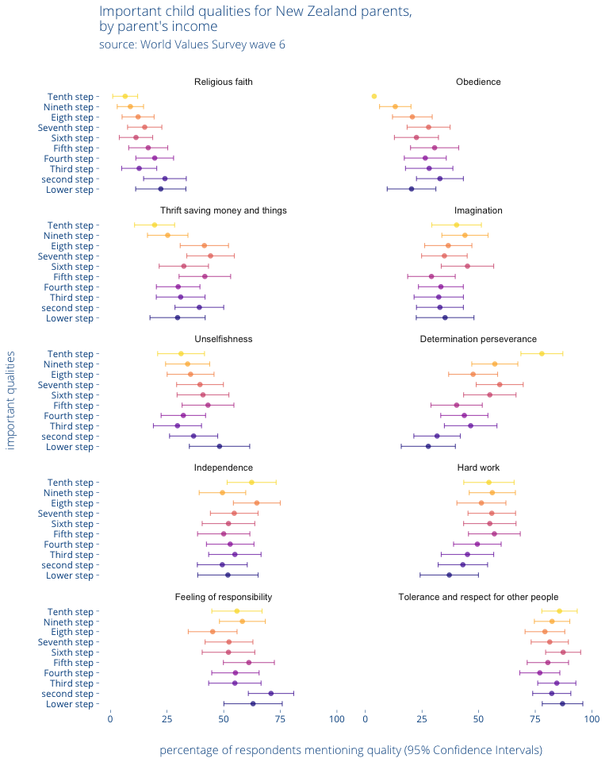

Important values of N.Z. parents
================

**Note**: This is the easy read (.md) version of the analysis showing
figures, to view the analysis code consult the .Rmd version.

The World Values Survey (available at
<http://www.worldvaluessurvey.org/wvs.jsp> ) is one of the two public
sources of data about New Zealander’s values that provide anonymised
survey results of individual respondents. This survey can be used to
explore what value are important to New Zealanders and sectors of the
New Zealand population that can be derived from the data. New Zealand
surveys were carried out in 1998 (wave 3, 1201 responses), 2004 (wave 5,
954 responses), and 2011 (wave 6, 841 responses).

## Parental Hopes

Among the questions asked was how many children the respondent has, and
what the hopes are of the respondents for their children (measured by
the mention of values in discussion). Topics monitored across all years
were Independence, Hard Work, Responsibility, Imagination, Tolerance,
Thrift, Determination, Faith, Unshelfishness, and Obedience.

Among New Zealand parents in the 2011 survey, the value most mentioned
was, by a large margin, tolerance.

<!-- -->

## Mothers and Fathers

Based on the self-declared gender of the respondent, I can explore the
degree to which particular qualities are gender specific within New
Zealand. There is a small difference of opinion on the value of “Hard
Work”, but not enough to change the overall pattern of importance of
each value.

<!-- -->

## Inferred age of children.

The year of birth of the respondent is included in the data, which can
be compared to the year of the survey to derive the age of the
respondent. Given the average age of first child at time of survey was
28, I can assume that the majority of parents under the age of 40 have
preteen children, the majority of parents aged 40 to 50 have teen
children, and the majority of parents aged over 50 have adult children.

As the age of parents, and thus their children, increases, the
importance of children showing imagination decreases. The importance of
children showing Responsibility increases with age, but this is not
enough to significantly change the overall order of importance. What
this graph also indicates is that if one is interested in specific
mentioning qualities rate of age ranges, then the overall figures are a
pretty good match for teens (largely in the centre of the ranges) and
may need slight upward or downwards adjustment if another age subgroup
is of interest.

<!-- -->

## Longitudinal

Because the same questions were asked in 3 different survey years, I can
compare cohorts to get some sense of if changes in values are occurring
due to age or due to events of the time. For those answering the survey
as respondents aged 28-40 in 1998, they can be compared to the
respondents aged 41-53 at the same time, and those ages 41-53 in 2011.

Hard work and Determination have become more important qualities from
1998 to 2011, but not by enough to change the relative importance of
either in relation to the other qualities.

<!-- -->

## Wealth

The World Values Survey includes the respondent’s place in a 10 step
(local) income band division. I can match this to the desired qualities
in children to identify what values are income-sensitive.

The qualities of Faith and Determination are both sensitive to income,
however the range of Faith is over a small enough range of responses
that income makes no difference to Faith in relation to other measures.
The amount that the wish to see children display Determination and
perserverance changes so much with income that it does change the
relative importance of variables in the overall model. Tolerance is
still most important, but the relative importance of other values shift
around. I would also note that Determination is being seen as different
to Hard work- the importance of Hard work itself is not changing as
incomes increase beyond the mid-range.

<!-- -->

## The importance of Tolerance and indicators of intolerance

While Tolerance is an important quality for children to develop for 83%
of New Zealand parents, for 13% of parents it was not mentioned. The
W.V.S. also asks respondents about what kinds of people (if any) the
respondent would not want as neighbours. Unsurprisingly, those
respondents that are homophobic or racist are less likely to see
Tolerance as an important quality in the next generation.

    ## 
    ## Call:
    ## glm(formula = Tolerance ~ People_who_have_AIDS + People_who_speak_a_different_language + 
    ##     People_of_a_different_religion + Drug_addicts + Heavy_drinkers + 
    ##     Homosexuals + Immigrants_foreign_workers + People_of_a_different_race + 
    ##     Unmarried_couples_living_together, family = binomial, data = logistic_data)
    ## 
    ## Deviance Residuals: 
    ##     Min       1Q   Median       3Q      Max  
    ## -2.4781   0.5177   0.5177   0.5708   1.3744  
    ## 
    ## Coefficients:
    ##                                       Estimate Std. Error z value Pr(>|z|)
    ## (Intercept)                            1.22569    0.22926   5.346 8.98e-08
    ## People_who_have_AIDS                  -0.64319    0.26100  -2.464   0.0137
    ## People_who_speak_a_different_language  1.08102    0.56047   1.929   0.0538
    ## People_of_a_different_religion         0.29411    0.85037   0.346   0.7294
    ## Drug_addicts                           0.50960    0.27386   1.861   0.0628
    ## Heavy_drinkers                         0.20680    0.23047   0.897   0.3696
    ## Homosexuals                           -0.63345    0.28079  -2.256   0.0241
    ## Immigrants_foreign_workers             0.45993    0.46311   0.993   0.3206
    ## People_of_a_different_race            -1.11751    0.55372  -2.018   0.0436
    ## Unmarried_couples_living_together     -0.04076    0.63150  -0.065   0.9485
    ##                                          
    ## (Intercept)                           ***
    ## People_who_have_AIDS                  *  
    ## People_who_speak_a_different_language .  
    ## People_of_a_different_religion           
    ## Drug_addicts                          .  
    ## Heavy_drinkers                           
    ## Homosexuals                           *  
    ## Immigrants_foreign_workers               
    ## People_of_a_different_race            *  
    ## Unmarried_couples_living_together        
    ## ---
    ## Signif. codes:  0 '***' 0.001 '**' 0.01 '*' 0.05 '.' 0.1 ' ' 1
    ## 
    ## (Dispersion parameter for binomial family taken to be 1)
    ## 
    ##     Null deviance: 763.72  on 840  degrees of freedom
    ## Residual deviance: 733.52  on 831  degrees of freedom
    ## AIC: 753.52
    ## 
    ## Number of Fisher Scoring iterations: 4

## Comparing different countries

As each country can be summarised by the proportion of respondents that
mentioned each of the 10 qualities, I can create a distance visualition
of countries based on a principal components analysis of the 10
qualities. The first two components (so the distribution below) explain
55% of variance. Four components would account for 83% of the variation.

Examing the loadings, the first component (accounting for ~36% of the
variance in the data) is largely focused on the variables of Faith and
Obedience. The second component (~20% of the variance) is strongly
focused on the quality of Hard work.

With 55% of the variance accounted for, culturally similar groups are
clustering in the data. For example, New Zealand is very similar to
Australia. This similarity needs the caveat the placement is being made
from all the qualities, using only select qualities of interest would
produce different groupings.

<!-- -->
